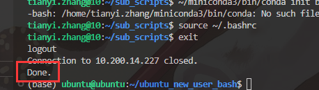
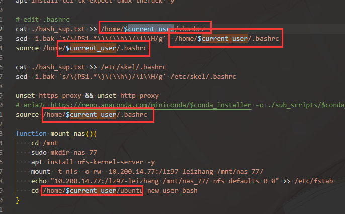

# ubuntu_new_user_bash
介绍在： https://dku-mp-zhang-group.github.io/docs/#/./server%20maintance/shell%20scripts
作为科研用途服务器管理员，为了便利操作需要：
## 管理员新建用户脚本
### 功能
1. 用户名批量和逐个配置可选择
2. 权限(docker 用户组)
3. 安装miniconda（脚本）
4. 创建workspace文件夹
5. 配置代理
6. 新用户创建/mnt/sdb下的数据存储文件夹  

出现下图done字样之前不要中断程序  

  
## 管理员第一次运行脚本
1. 运行之前：
    - 请勿在root下运行
    - 登录ubuntu管理员权限账户，如果没有则修改`current_user="ubuntu"`中`ubuntu`至当前用户
    - 安装expect: `sudo apt install tcl tk expect aria2 git net-tools -y`
    - 临时设置代理: `export https_proxy=http://10.200.13.85:3128 && http_proxy=http://10.200.13.85:3128`
    - 最好进行git密码存储设置`git config --global credential.helper store`
    - 在*默认工作目录(~/)*下clone本仓库:  `git clone https://github.com/DKU-MP-Zhang-Group/ubuntu_new_user_bash.git`
### 功能
1. 安装远程桌面（脚本）
2. 挂载nas
    - 同时修改fstab
      - nas77: `10.200.14.77:/lz97-leizhang /mnt/nas_77/ nfs defaults 0 0`
      - 
3. 修改主机名，并通过PS1设置完全展示主机名， 同步修改/etc/skel/下的`.bashrc`文件(PS1中\h ——> \H, 显示全部主机名)
4. 安装需要的软件：tmux, thefuck(修改bash), docker
5. 文件夹权限：/mnt/sdb
## 管理员nas权限管理脚本（可以被admin wizard调用） 
只要组名一致，不同服务器上的用户就可以访问
1. 新建一个用户组`sudo groupadd groupname`， 格式名为`nasname_user`, 比如`nas_77_user`
2. 把nas所有权改为该用户组`sudo chgrp groupname nasname`
3. 添加用户到用户组`sudo usermod -aG groupname username`
## 小黑屋配置
如果普通用户由于操作失误多次造成服务器崩溃等恶性bug，可以启用小黑屋配置：
1. 将本文件夹下的`0-temp-access-control.conf`文件移动到`/etc/ssh/sshd_config.d`路径下，并修改或添加匹配的用户
2. 重启ssh服务并踢下用户:
    ```bash
    sudo systemctl restart sshd.service
    sudo pkill -kill -u tianyi.zhang
    ```
3. 用`who`检查用户是否还有登录终端，有的话pkill掉

最终的效果是用户可以使用xftp进行文件传输，但是无法使用ssh登录
### TODO
1. 自动查找没有
## 新用户第一次运行脚本
1. 修改密码
2. 配置git
## 同步脚本
1. 同步不同服务器之间的设置
    - 不同新用户文件设置：/etc/skel/下
## 基本使用文档
## 机房准入权限
## 修改ubuntu与root用户密码

## TODO
1. 

将此处的绝对文件路径改为根据当前执行文件确定的相对路径。这样可以不局限于在`~/`目录下运行。  
2. 自动检测数据盘，并修改`/mnt/sdb`  
3. 检测bashrc文件，如果已经修改完成则不再修改 
